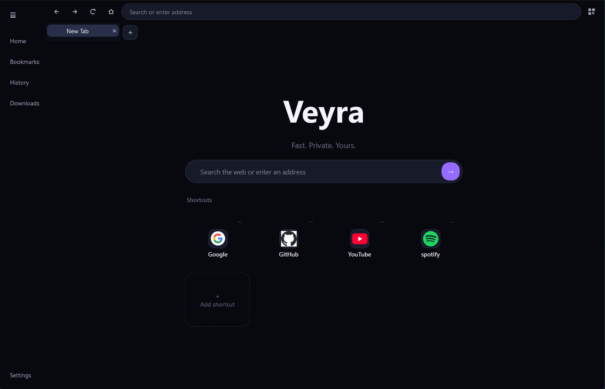
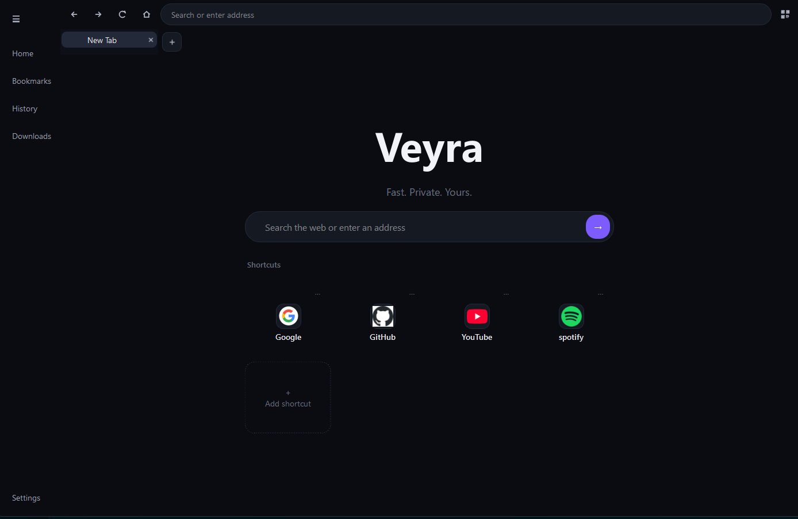
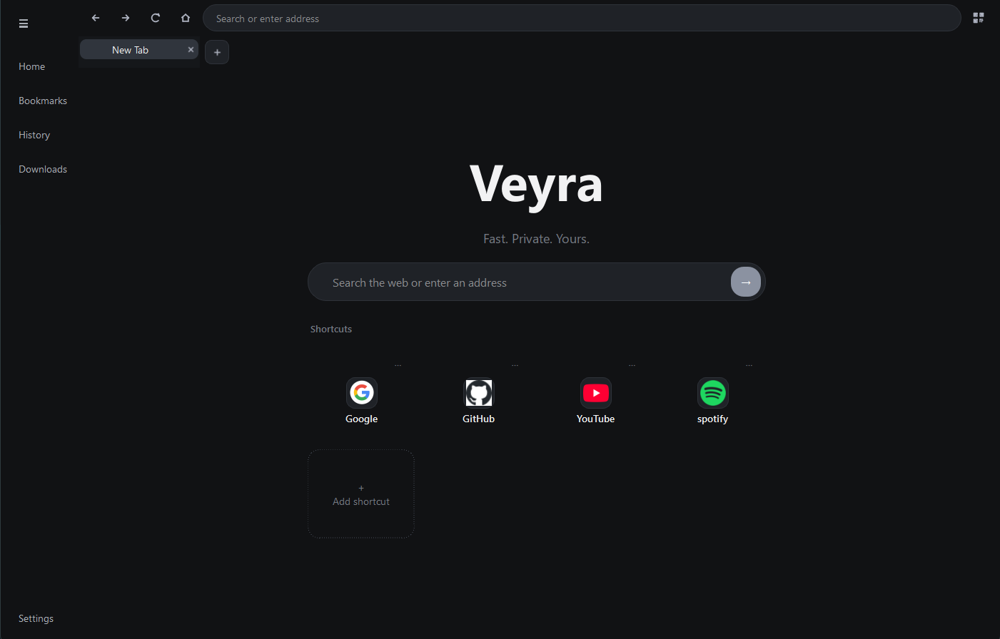
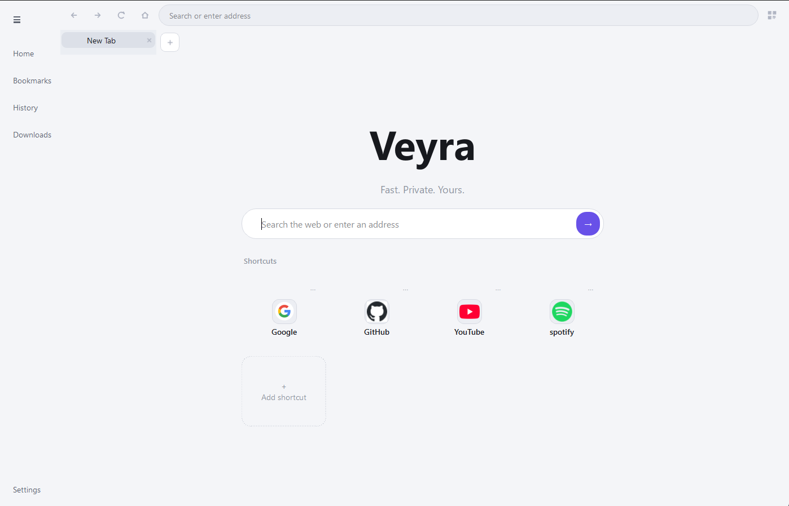

<div align="center">

# Veyra

### A modern desktop browser built with Python, PySide6 and Qt WebEngine.

Fast. Private. Yours.

[](https://www.python.org/)
[](https://doc.qt.io/qtforpython-6/)
[](https://doc.qt.io/qt-6/qtwebengine-index.html)
[](https://github.com/BudowA2012/Veyra-browser)

[Features](#-features) • [Themes](#-themes) • [Screenshots](#-screenshots) • [Roadmap](#-roadmap) • [Development](#-development)

</div>

---

## ✨ What is Veyra?

**Veyra** is a custom desktop web browser focused on a clean interface, fast everyday navigation and a UI that can be shaped around the user instead of looking like a default Qt application.

The project is still in active development, but the core browser experience already works: tabs, web search, custom shortcuts, downloads, history, themes, settings and QR sharing are all part of the current build.

> Veyra is currently an experimental personal browser project, not a finished replacement for Chrome, Edge or Firefox yet.

---

## 🚀 Features

### Browsing
- Multi-tab browsing
- URL navigation and web search from the address bar
- New Tab page with editable shortcuts
- Website favicons in tabs and shortcut cards
- Back, forward, reload and home navigation
- Support for links opening in new tabs/windows
- QR code generation for the current page

### Downloads
- Native Qt WebEngine downloads
- Dedicated `Downloads/Veyra` folder
- Download progress
- Pause / resume / cancel
- Open downloaded file
- Open downloads folder
- Automatic duplicate filename handling

### Personalization
- Four built-in themes
- Live theme switching from Settings
- Theme choice saved between launches
- Editable New Tab shortcuts
- SQLite-backed local shortcut storage

### Browser UI
- Custom tab strip
- Dedicated new-tab button
- Custom browser icons instead of text symbols
- Collapsible sidebar
- History view
- Settings view
- Loading progress indicator

---

## 🎨 Themes

Veyra currently ships with four visual styles. They all use the same layout and components, but change the overall atmosphere of the browser.

| Theme | Look | Best for |
|---|---|---|
| **Midnight** | Deep navy-black surfaces with Veyra's signature purple accent | Everyday use and the default Veyra look |
| **Aurora** | Darker, more futuristic palette with a stronger violet accent | A more expressive cyber / neon feel |
| **Graphite** | Neutral charcoal and grey with reduced accent saturation | Minimal, distraction-free browsing |
| **Light** | Bright grey-white interface with purple highlights | Daytime use and bright environments |

### Aurora



### Midnight



### Graphite



### Light



---

## 🖼 Screenshots

<table>
  <tr>
    <td align="center"><b>Aurora</b></td>
    <td align="center"><b>Midnight</b></td>
  </tr>
  <tr>
    <td></td>
    <td></td>
  </tr>
  <tr>
    <td align="center"><b>Graphite</b></td>
    <td align="center"><b>Light</b></td>
  </tr>
  <tr>
    <td></td>
    <td></td>
  </tr>
</table>

---

## 🧭 Current project structure

```text
Veyra/
├── app/
├── core/
│   ├── browser/
│   ├── downloads/
│   ├── history/
│   └── storage/
├── data/
├── resources/
│   ├── icons/
│   └── themes/
├── tests/
└── ui/
    ├── components/
    ├── downloads/
    ├── history/
    ├── main_window/
    ├── new_tab/
    ├── settings/
    ├── sidebar/
    ├── styles/
    └── tabs/
```

The project is intentionally split into browser logic, storage and UI components so new features can be added without turning the main window into one giant file.

---

## 🛠 Development

### Requirements

- Python 3.12+
- PySide6
- Qt WebEngine
- `qrcode[pil]` for QR sharing

### Clone

```bash
git clone https://github.com/BudowA2012/Veyra-browser.git
cd Veyra-browser
```

### Create a virtual environment

#### Windows PowerShell

```powershell
python -m venv .venv
.venv\Scripts\Activate.ps1
```

### Install dependencies

If the repository contains `requirements.txt`:

```powershell
pip install -r requirements.txt
```

For the current feature set, the important packages are:

```powershell
pip install PySide6 qrcode[pil]
```

### Run Veyra

```powershell
python -m app.launcher
```

---

## ⌨️ Keyboard shortcuts

| Shortcut | Action |
|---|---|
| `Ctrl + L` | Focus address bar |
| `Ctrl + T` | New tab |
| `Ctrl + W` | Close current tab |
| `Ctrl + R` | Reload current page |
| `Ctrl + B` | Toggle sidebar |
| `Ctrl + Shift + Q` | Generate QR code for current page |

---

## 🗺 Roadmap

The next major browser features planned for Veyra are:

- [x] Custom New Tab page
- [x] Editable shortcuts
- [x] Browser themes
- [x] Settings page
- [x] Downloads manager
- [x] QR sharing for the current page
- [ ] Download popup
- [ ] Full search-engine selection support
- [ ] Session restore
- [ ] Address-bar suggestions
- [ ] Crash recovery
- [ ] Reopen closed tab
- [ ] Better tab context menu
- [ ] Bookmarks system
- [ ] Per-site permissions
- [ ] Find in page
- [ ] Zoom controls
- [ ] Private browsing profile

The long-term goal is to keep Veyra lightweight and customizable while gradually adding the quality-of-life features expected from a modern desktop browser.

---

## 🧪 Project status

Veyra is in **early development**.

That means:
- UI and architecture can still change
- some settings may exist before their full backend behaviour is implemented
- bugs are expected
- features are being added incrementally

If something breaks, opening an issue with reproduction steps and screenshots is the most useful way to help.

---

## 🤝 Contributing

Ideas, bug reports and pull requests are welcome.

When contributing:
1. Keep UI code separated from core browser logic where possible.
2. Avoid large unrelated changes in one pull request.
3. Test the existing tab, navigation, download and theme flows after UI changes.
4. Keep the design consistent with Veyra's minimal interface.

---

## 💡 Why Veyra?

Most browser projects start by copying an existing interface. Veyra is being built the other way around: first create a browser shell that feels personal and cohesive, then expand the feature set on top of it.

The result is still a work in progress, but the goal is simple:

<div align="center">

### Fast. Private. Yours.

</div>
